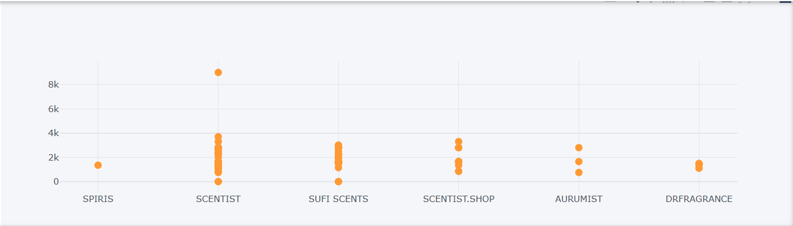
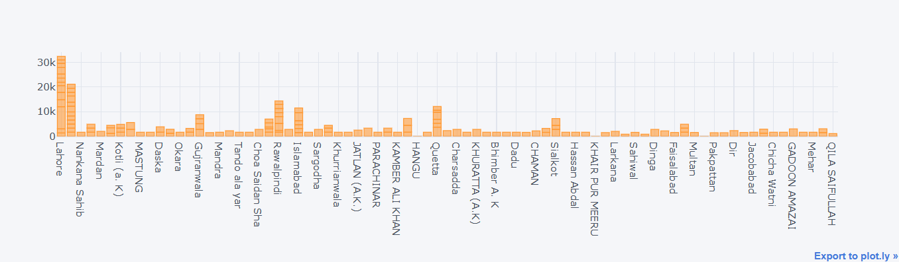
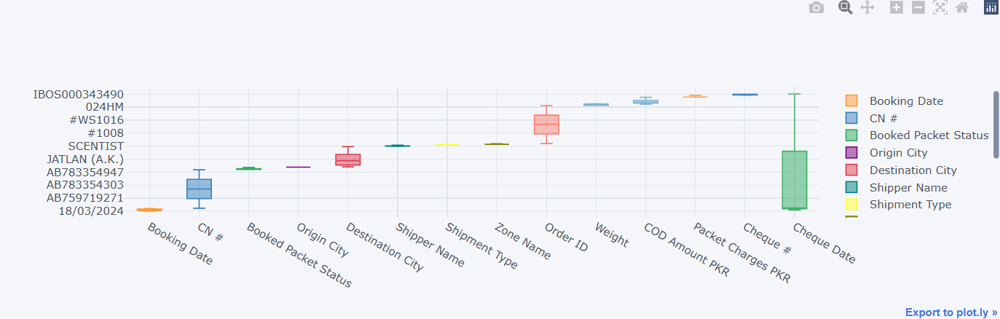
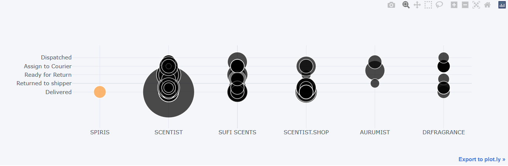

# Financial Data Analysis and Visualization - E-Commerce Company

This repository contains Python code for analyzing and visualizing financial data of an e-commerce company. The analysis is primarily focused on examining various financial aspects such as COD (Cash on Delivery) amounts, packet charges, delivery statuses, and more.

## Video Link
[Check out the Video for Analysis] (https://drive.google.com/file/d/1U6aaEl-yajzFi4P2ZKigQXgVB5Hd8f-C/view?usp=sharing)

## Data

The financial data used for this analysis is sourced from the company's invoice records. The dataset used for analysis can be found in the file `18-24 March Invoice Data.csv`.

## Tools and Libraries Used

- Python
- NumPy
- Pandas
- Matplotlib
- Seaborn
- Plotly
- Cufflinks

## Instructions

To run the analysis and visualize the financial data:

1. Clone this repository to your local machine.
2. Ensure you have Python and the required libraries installed.
3. Run the Python script `financial_analysis.py`.
4. View the generated visualizations and analysis results.

## Analysis Overview

1. **Exploratory Data Analysis (EDA):**
   - Analyzing booking dates, packet statuses, destination cities, etc.
   
2. **COD Amount vs. Packet Charges:**
   - Calculating total COD amounts and packet charges.
   - Analyzing the difference between total COD amounts and packet charges.

3. **Visualization:**
   - Scatter plots, bar plots, box plots, and bubble plots are utilized for visualizing different aspects of the financial data.
   - Interactive plots are generated using Plotly and Cufflinks libraries.

## Sample Visualization

## Note

- Make sure to replace the dataset file path in the Python script if the file location changes.
- Feel free to customize the analysis and visualizations according to your requirements.

For any questions or suggestions, feel free to reach out.
